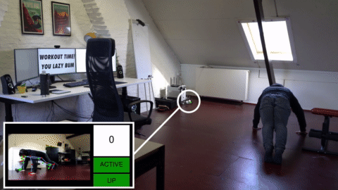

# Pushup Lockscreen



## Quick overview

Most of the repo is a mess. If you're just looking for the final product with (arguably) better quality code that kind of should maybe work, check the inside of `pushup_lockscreen` folder. The normal flow would be: `labeling_tool.py` > `clean_labeled_data.py` > `landmark_offline.py` > `training.py` > `inference.py`. If you really want to get this working, open an issue and I'll clean up the repo :)

`HPO` was a test to optimize the model using ClearML
`notebooks` can be safely ignored, the good training code is in `pushup_lockscreen`

## Initialize clearml
Most of the repo uses ClearML as experiment manager and central output manager. Get a free account on app.clear.ml or host your own server (check their github).
`pip install clearml`
and
`clearml-init`

## OAK 1
Every script assumes you have the OAK-1 attached to the current machine. I was able to run everything on the same machine and then moved only the inference to the raspberry pi!

## Raspberry Pi
To use playaudio, install gstreamer bindings:
```
sudo apt install python3-gst-1.0
```